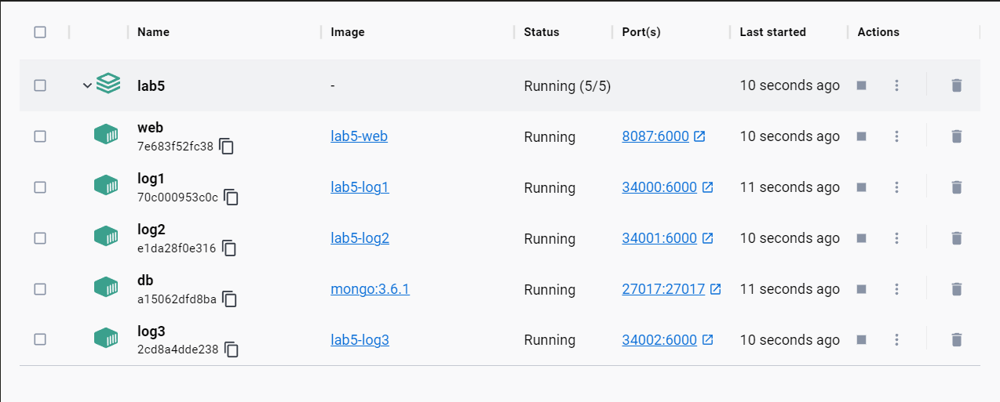
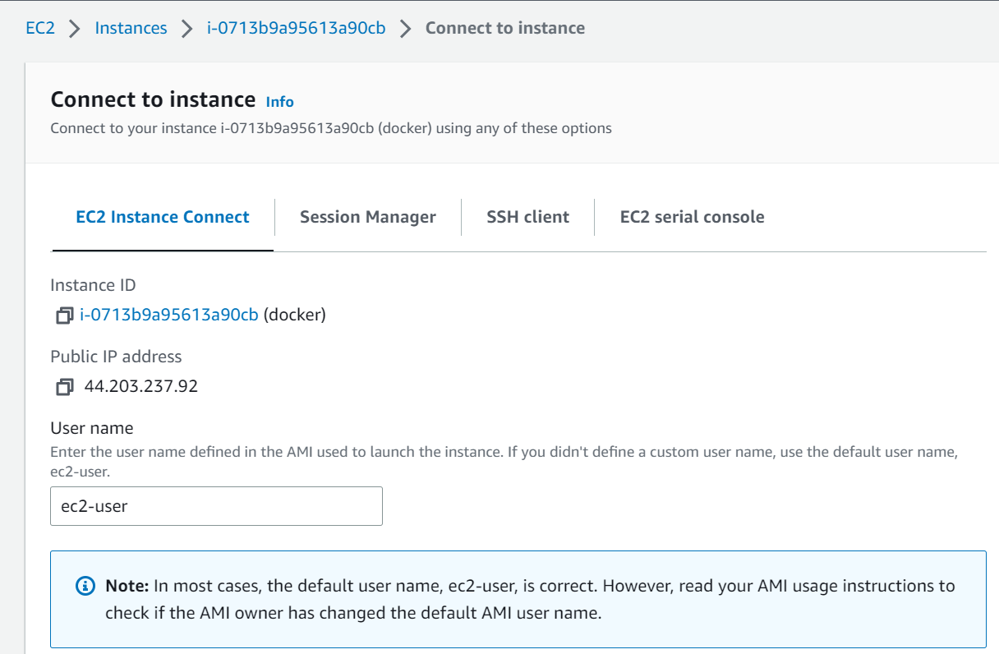

# Taller 5 AREP

## Información del programa 💾

Este proyecto está basado en una arquitectura de tipo Cliente-servidor, en este caso cuenta con 3 servidores y para poder
distribuir la carga se usa Round Robin con el fin de que no se sature un servidor este lo que hace es repartir en tres la carga,
para el tema del despliegue se usa Docker el cual es capaz de automatizar este proceso usando contenedores.
En este caso este se almacena en un servidor EC2 de AWS, para ser desplegado desde este.

## Arquitectura


Como podemos ver en la imagen se puede evidenciar fácilmente como se está estructurando, en este caso si no hubiera
realizado el **APP-LB-RoundRobin** por medio de un **HttpServer** se podría ver de mejor manera la arquitectura
**Cliente-servidor**, este para poder comunicarse con los **LogServices** utiliza peticiones **GET** el cual usa como Framework
**Spark**, una vez que es enviada esta información hacia el back este se encarga de almacenarlo dentro de una base de datos
no relacional, en este caso estamos usando **MongoDB**, después el back le solicita los datos que tenga para este
encargarse de mandar los 10 últimos datos almacenados dentro de la base datos por medio de **JSON** para ser mostrados en el **Frontend**.

## Para utilizar el proyecto 👩‍💻

1. Debes clonar el proyecto haciendo uso del comando:
```
git clone https://github.com/gabriela-castro-s/TALLER-5-AREP.git
```

2. Debemos compilar el proyecto y corroborar que funciona correctamente
```
mvn clean install
mvn package
```

3. Una vez ya compilado debemos estar en la carpeta principal donde ejecutaremos el siguiente
comando para generar las imagenes.
```
docker-compose up -d
```

4. En Docker Hub creamos tres respositorios diferntes, uno para la base de datos, 
otro para el balanceador y el último para los logs en donde se suben con los siguientes comandos:
```
docker tag nombre-imagen usuario/repositorio

docker login

git push usuario/repositorio
```

5. En AWS creamos una nueva instancia de la máquina EC2 y nos conectamos a ella por medio de un terminal remoto de linux preferiblemente,
luego utilizamos los siguientes comandos para subir las imagenes creadas a AWS. La ´primera es para la base de datos, las siguientes 3 para los logs
y la última para el balanceador

   

```
sudo docker run -d -p 42000:6000 --name nombre-imagen usuario/repositorio1
sudo docker run -d -p 34000:6000 --name nombre-imagen usuario/repositorio2
sudo docker run -d -p 34001:6000 --name nombre-imagen usuario/repositorio2
sudo docker run -d -p 34002:6000 --name nombre-imagen usuario/repositorio2
sudo docker run -d -p 27017:6000 --name nombre-imagen usuario/repositorio3
```
**Recuerde**, es importante abrir el puerto 42000 en su instancia EC2.

6. Finalmente, está lista para probar utilizando el link proporcionado por su instancia de EC2. Debe verse así:


## Requisitos 📋
- Java: Ambiente de desarrollo
- Maven: Administrador del ciclo de vida del Proyecto
- Git: Controlador de versiones

## Construido con 🛠️

IntelliJ IDEA 2022.3.2 (Community Edition)

## Autores ✒️

* **Gabriela Castro Santamaría** [gabriela-castro-s](https://github.com/gabriela-castro-s) 